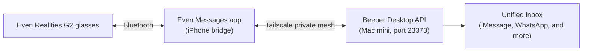

# Glasses Messaging Bridge — Wearable Notifications via Beeper + Tailscale

A pipeline that delivers unified-inbox messages to Even Realities G2 smart glasses and lets me reply from the glasses, by integrating a phone-side bridge app with a desktop messaging API over a private mesh network. Built by Jacien Williams (jacien.co).

## Privacy statement
This repository contains architecture and code only — no message content, no network addresses, and no API tokens. The real mesh IP and credentials are intentionally omitted.

## What it is
The glasses display incoming messages and accept short replies. They do not talk to the messaging platform directly. Instead, the glasses pair over Bluetooth to a bridge app on the phone, and that app talks to the desktop messaging API across a private mesh network, so the whole thing works without exposing anything to the public internet.

## Architecture

## Key engineering decisions
- **Phone as the bridge, not the glasses.** The glasses have no general network stack of their own, so the integration point is the phone app over Bluetooth, and the network call happens phone-to-desktop. Getting the integration boundary right was the whole design.
- **Private mesh instead of port-forwarding.** The phone reaches the desktop API over a Tailscale mesh network, so no router ports are exposed and the link works from anywhere without opening the desktop to the public internet.
- **Bind the API to the mesh interface.** The desktop messaging API defaults to listening only on localhost, so it had to be explicitly enabled to listen on all interfaces — including the mesh address — before the phone could reach it.
- **Sensitive actions enabled deliberately.** Replying from the glasses requires the API token to permit sensitive actions, which is an explicit, scoped grant rather than a default.

## What I would build next
- Add a small filter so only selected conversations reach the glasses, reducing noise.
- Add a reconnect/retry path for when the mesh link drops.
