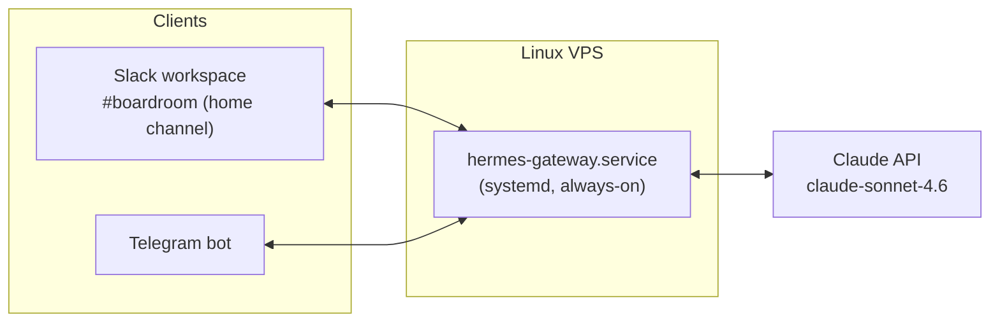

# Hermes — Self-Hosted Multi-Agent Messaging Gateway

A 24/7 messaging gateway that lets AI agents operate inside Slack and Telegram from a single always-on Linux host. Built and operated by Jacien Williams (jacien.co).

## What it is

Hermes runs as a persistent background service on a Linux VPS and bridges two chat platforms — a private Slack workspace and Telegram — to the Claude API. Messages sent in a designated Slack channel or to the Telegram bot are routed to the model and answered in-thread. The service is registered with the operating system so it starts automatically on boot and is restarted automatically if it crashes.

## Architecture

## Key engineering decisions

- **Always-on as a system service, not a script.** The gateway is registered with `systemd` and enabled on boot, so it survives reboots and auto-restarts on failure. This is the difference between a demo that runs while a terminal is open and a service that stays up unattended.
- **Provider chosen for sustainability, not benchmarks.** The model provider was switched to Anthropic with OAuth authentication, and `claude-sonnet-4.6` was selected over a larger model specifically because a 24/7 agent must be economical per call. A hard monthly spend cap was set to make cost failure impossible rather than unlikely.
- **One home channel as the control surface.** A single private Slack channel (`#boardroom`) is registered as the agent's home, giving every future bot one predictable place to live and one place to observe behavior.
- **Loop-guard awareness for multi-agent expansion.** The design anticipates multiple bots in one channel, where the failure mode is bots replying to each other indefinitely. The architecture isolates that risk before adding a second agent.

## Operational notes

- Logs are read with the host's service journal for live diagnostics.
- Secrets (model credentials, platform tokens) are kept out of version control and off this document by design.
- The host IP, tokens, and workspace identifiers are intentionally omitted from this public repository.

## What I would build next

- Add a second agent in the same channel with an explicit loop guard and per-agent role separation.
- Add structured logging and a small uptime/health check exposed to a monitoring tool.
