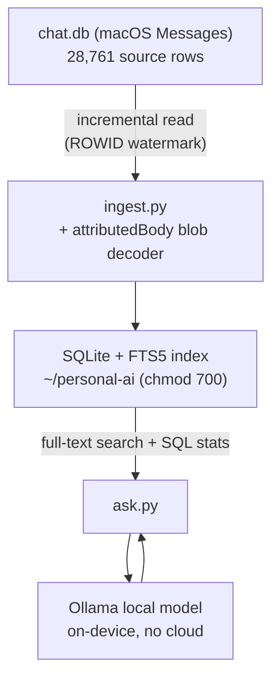

# Local Message Intelligence — On-Device Retrieval & Analysis

A private, fully on-device system that ingests a large personal message archive (28,000+ records) into a searchable local store and answers analytical questions about it using a local language model. No data ever leaves the machine. Built by Jacien Williams (jacien.co).

## Privacy statement
This repository contains architecture and code only. It contains no message content, no contact identities, and no exported data. The system is designed so that the corpus and all derived data stay on a single device, in a permission-locked directory outside any cloud-synced folder.

## What it is
The system reads new messages incrementally from the local macOS Messages database, decodes message bodies stored in a binary format that modern macOS uses, indexes everything into a local full-text search store, and lets a local model answer questions grounded in SQL-derived statistics and full-text excerpts — all on-device.

## Architecture

## Key engineering decisions
- **Full-text search, not a vector database.** The questions this system answers are largely statistical and lexical (counts, who/when, term frequency), so a SQLite FTS5 index is a better and far lighter fit than embeddings and a vector store.
- **Incremental ingestion with a watermark.** Each run processes only rows newer than the last processed row id, instead of re-reading and re-indexing the entire archive every cycle. This keeps updates cheap and fast.
- **Binary body decoding.** Modern macOS stores many message bodies in a binary `attributedBody` blob with a `NULL` plain-text field; the ingester decodes that blob so those messages are not silently lost.
- **On-device model for privacy.** A local Ollama model narrates the SQL results and excerpts, so no message data is ever sent to a cloud API.
- **Permission-locked, outside iCloud.** The data directory is created with owner-only permissions and lives outside any cloud-synced folder, removing the risk of a private archive syncing to the cloud as plaintext.

## What I would build next
- Move from the smaller local model to a larger one for denser analytical prompts (see the case study for why).
- Add a scheduled incremental run so the index stays current automatically.
